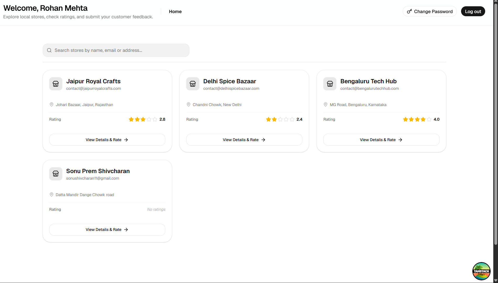
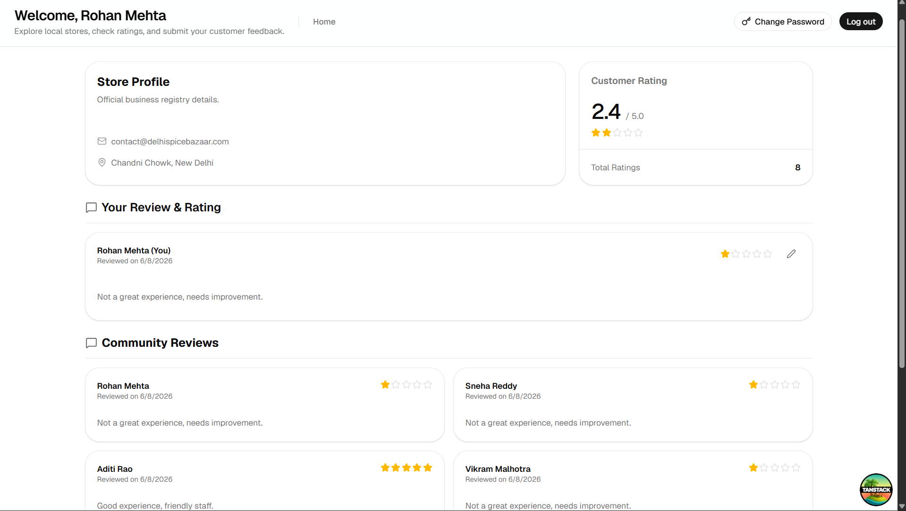
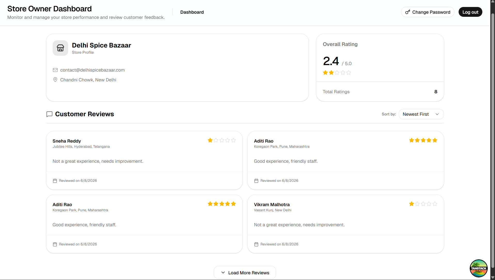
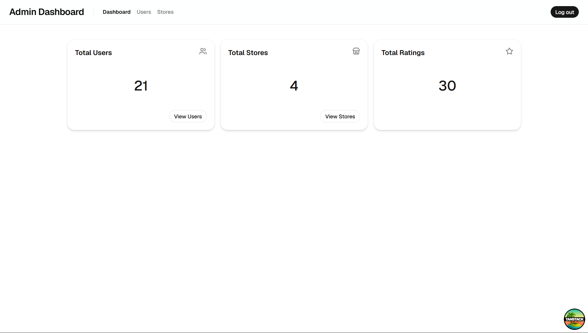
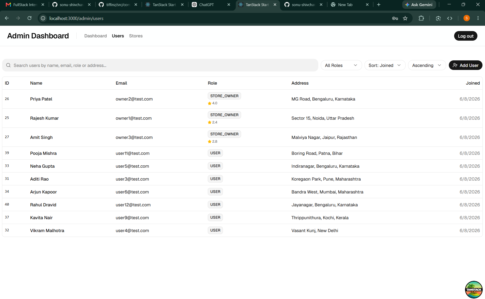
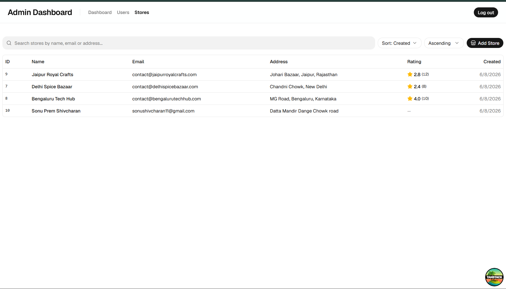

## Follow project Setup Instructions

### [Frontend Setup ](frontend/README.md)

### [Backend Setup ](frontend/README.md)

# Using Docker compose

# Store Rating Web Application

A full-stack web application that allows users to register, sign in, search registered stores, and submit/modify store ratings from 1 to 5 stars. The system features a unified sign-in flow with role-based dashboard screens for:

1. System Administrators (Manage stores & users, view platform metrics)
2. Store Owners (Monitor store stats, view customer feedback metrics, average ratings)
3. Normal Users (Discover stores, submit & update ratings/reviews)

---

## Screenshots

### Normal User Dashboard

### Store Details & Review Submission

### Store Owner Dashboard

### System Administrator Dashboard

### Admin Users Management

### Admin Stores Management

---
